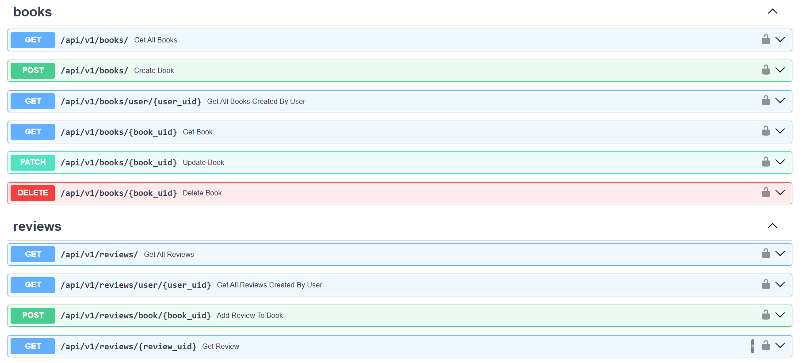

### This repository contains books FastAPI project

What's used for this project:
1. **FastAPI** - to create API endpoints
2. **Swagger** - API documentation http://127.0.0.1:8000/docs & OpenAPI specification JSON format http://127.0.0.1:8000/openapi.json
3. **ReDoc** - alternative API documentation http://127.0.0.1:8000/redoc
4. **Pydantic** - data validation for API calls (input & output)
5. **Alembic** - for db migrations
6. **PostgreSQL** - db to persist data
7. **Redis** - caching db, to minimize number of main db calls
8. **Celery & Flower** - for background tasks - Flower UI http://localhost:5555/

___

To run project locally: 
1. **Setup db** - have PostgreSQL installed on your machine -> create new db for the project via pgAdmin or other way
2. **Setup .env file** - update `.env` file with your own paths and parameters
3. **Apply migration files to db** - run `alembic upgrade head`
4. **Run server** - run `fastapi dev src/`
5. **Start redis container** (to check jti token blocklist and for celery tasks) - run `docker run -d -p 6379:6379 --name redis redis`, verify it's up and running via Docker Desktop or run `docker ps`
6. **Use API** - make API call to any endpoint via Postman OR Swagger UI
7. **Start celery worker** (for background tasks like send_email_task) - start worker `celery -A src.celery_tasks.celery_app worker --loglevel=info --pool=solo` (`--pool=solo` for Windows to avoid access denied error), 
start UI `celery -A src.celery_tasks.celery_app flower` and visit http://localhost:5555/ to see workers, tasks etc.

To create and apply migrations:
1. **Create migration** file in project + `alembic_version` table in db - run `alembic revision --autogenerate -m "init"`
2. **Apply migration** file to the db - run `alembic upgrade head`

To run task via Celery to check that it works:
1. **Start celery worker** - run `celery -A src.celery_tasks.celery_app worker --loglevel=info --pool=solo`
2. **Run code in Python console**
```
from src.celery_tasks import send_email_task
emails = ['email@gmail.com']
task_1 = send_email_task.delay(emails, 'Test Celery', '<h1> CELERY test :) </h1>')
task_1.status
```

To run schemathesis tests based on openapi json documentation run `st run http://localhost:8000/openapi.json --experimental=openapi-3.1`
Note: server needs to run, since error logs will be there.

To force stop project if normal method doesn't work - kill all python tasks `taskkill /F /IM python.exe`

___
_Example of API calls and data:_

BOOKS API calls sample:
* GET http://127.0.0.1:8000/api/v1/books
* POST http://127.0.0.1:8000/api/v1/books
* GET http://127.0.0.1:8000/api/v1/books/{uid}

Example of data used for API call to create book:

`{
        "title": "The Color of Magic",
        "author": "Terry Pratchett",
        "publisher": "Corgi",
        "page_count": 287,
        "language": "English"
}`

USER API calls sample:
* POST http://127.0.0.1:8000/api/v1/auth/signup
* POST http://127.0.0.1:8000/api/v1/auth/login
* POST http://127.0.0.1:8000/api/v1/auth/refresh_access_token

Example of data used for API call to create user:

`{
    "email": "johndoe@gmail.com",
    "username": "john doe",
    "first_name": "john",
    "last_name": "doe",
    "password":"12345"
}`

REVIEW API calls sample:
* GET http://127.0.0.1:8000/api/v1/reviews
* GET http://127.0.0.1:8000/api/v1/reviews/860a8e94-deee-4b59-8319-37e2336b8556
* POST http://127.0.0.1:8000/api/v1/reviews/book/02298daa-d341-4327-88fc-a9dc8f4b8ed1

Example of data used for API call to create review:

`{
    "rating": 5,
    "review_text": "it's awesome! recommend to everyone!"
}`

---

Postman API calls:


Swagger API calls:



Celery tasks (Flower UI):

